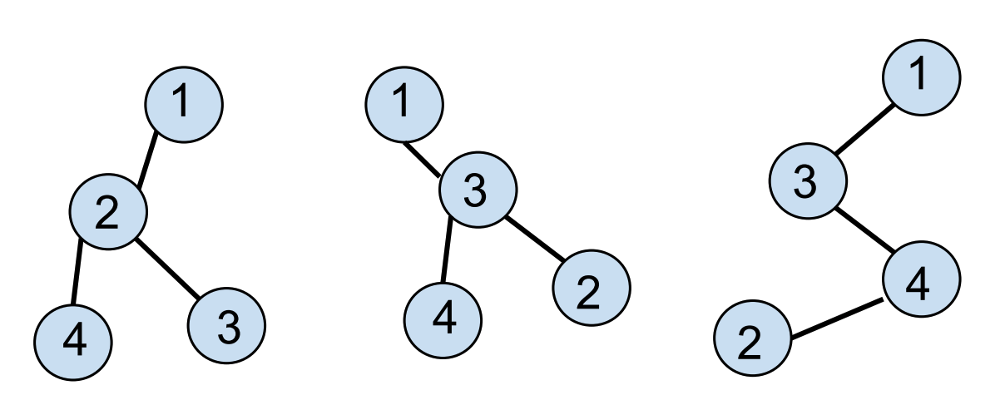

## GGNN Implementation in PyTorch and Tensorflow

This repo contains an implementation of Gated Graph Sequence Neural Networks (Li et al) in PyTorch and Tensorflow.
For implementations of Tensorflow, I tried out residual connection between the message propagation model and batch normalization across node states for more stable performance.

### Task


The repo contains utility functions that generates pairs of isomorphic and non-isomorphic graphs.
In the figure above, the first two graphs are isomorphic whereas the third one is not isomorphic to the previous two.

### Usage
To run the code run
```
python main.py --vis_server=local --lr=1e-4 --difficulty=1 --graph_size=4 --connection_rate=0.5 --optimizer=adam
```
More detailed configuration can be found in `config.py` file, where you can set the difficulty of the graphs being isomorphic.
The repo is developed using Python3.
The default visualization of the training curve is using Visdom.